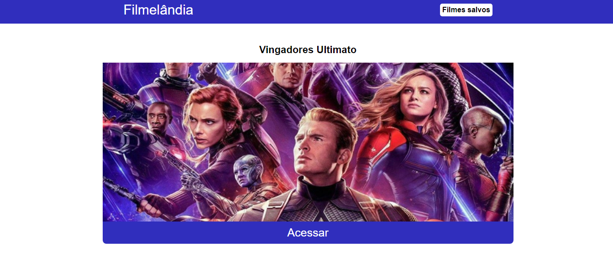

<h1 align="center">
  Filmelândia
</h1>

<div>
  
</div>

## 💻 Projeto
Filmelândia é um projeto onde temos nossa lista de filmes e você pode ver mais informações sobre o filme, favoritar ou ser redirecionado para ver o seu trailer no Youtube. A lista de filmes é retornada de uma API.
<br><br>

## 🚀 Projeto em produção
Para acessar o projeto online clique [aqui](https://filmeslandia-rsa.netlify.app/).

## Clonar Projeto

Para clonar e poder instalar o projeto em sua máquina, você precisará de algumas ferramentas, como:

- [Git](https://git-scm.com)
- [Node.js](https://nodejs.org/en/).

Além disto é bom ter um editor para trabalhar com o código como [VSCode](https://code.visualstudio.com/).

### Passo a Passo para poder executar a aplicação:

- Clonar o projeto;

```bash
 git clone <repositorio>
```

- Acessar pasta do projeto pelo terminal/cmd;

```bash
cd .../projetofilmes
```

- Instale as dependências do projeto (arquivo package.json);

```bash
npm install <todas dependências>
```

- Execute a aplicação;

```bash
npm start
```

O Projeto iniciará de forma local na porta padrão do seu sistema.

## 🛠 Tecnologias
As seguintes ferramentas foram ultilizada na construção do projeto:

- [React](https://pt-br.reactjs.org/)
- [React Router](https://reactrouter.com/);
- [Axios](https://www.npmjs.com/package/axios);
- [react-toastify](https://www.npmjs.com/package/react-toastify);
- [Node.js](https://nodejs.org/en/);
- [API](https://sujeitoprogramador.com/r-api/?api=filmes/).

